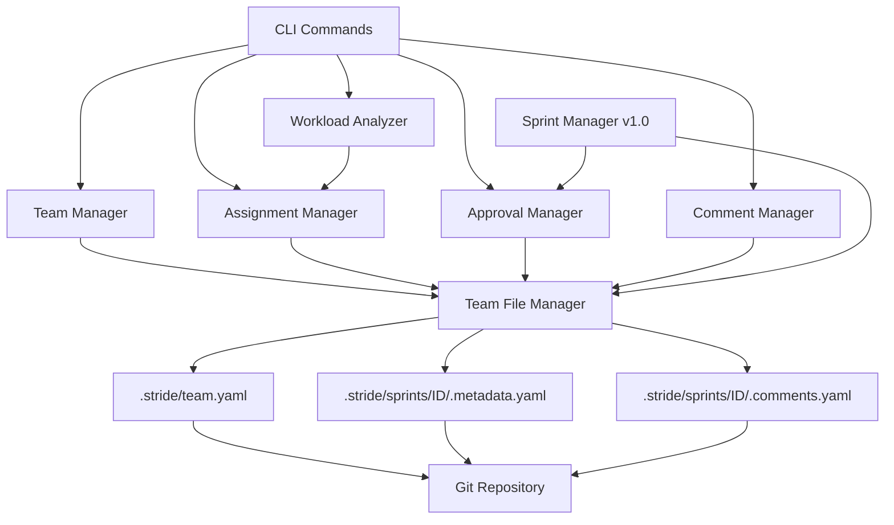

# Design

## Architecture

This sprint extends Stride's file-based architecture with team collaboration features while preserving the v1.0 solo workflow. The design follows the modular monolith pattern established in `.stride/project.md` Section 5.

**High-Level Component Overview:**



**New Modules Introduced:**
- `stride/commands/team.py` - Team management CLI commands
- `stride/commands/assign.py` - Sprint assignment CLI commands  
- `stride/commands/workload.py` - Workload analysis CLI command
- `stride/core/team_file_manager.py` - YAML I/O for team files
- `stride/core/assignment_manager.py` - Assignment logic and validation
- `stride/core/approval_manager.py` - Approval workflow enforcement
- `stride/core/comment_manager.py` - Comment threading and storage
- `stride/core/workload_analyzer.py` - Workload calculations and AI recommendations

**Existing Modules Modified:**
- `stride/models.py` - Add TeamConfig, TeamMember, SprintMetadata, Comment models
- `stride/cli.py` - Register new command groups (team, assign, workload)
- `stride/core/sprint_manager.py` - Integrate approval checks in complete() method
- `stride/commands/list.py` - Display assignee and approval columns
- `stride/commands/show.py` - Display ownership, approvals, comments
- `stride/commands/status.py` - Show team-wide sprint distribution

**Component Responsibilities:**

- **Team Manager**: CRUD operations for team members, role validation, AI role suggestions
- **Assignment Manager**: Sprint-to-member assignment, workload tracking, reassignment history
- **Approval Manager**: Approval workflow enforcement, policy validation, threshold checking
- **Comment Manager**: Threaded comment storage, resolution tracking, file/line anchoring
- **Workload Analyzer**: Sprint distribution calculations, complexity scoring, AI balancing recommendations
- **Team File Manager**: Atomic YAML read/write operations, validation, error handling

**Design Principles:**
- **Opt-in activation**: All features require `stride team init` first (backward compatible)
- **Atomic operations**: YAML writes use temp files to prevent corruption
- **Git-friendly**: Human-readable diffs, meaningful commit messages
- **Zero infrastructure**: No databases, APIs, or external services required
- **Offline-capable**: All operations work without network connectivity

---

## Data Flow

### Team Initialization Flow

```
User: stride team init
  ↓
CLI: Prompt for project name, initial members (optional)
  ↓
Team Manager: Validate input, analyze project.md for AI role suggestions
  ↓
Team File Manager: Create .stride/team.yaml with schema_version="1.5"
  ↓
Git: Stage team.yaml for commit
  ↓
CLI: Display success message with next steps
```

### Sprint Assignment Flow

```
User: stride assign SPRINT-ABC --to alice
  ↓
CLI: Parse arguments, validate sprint exists
  ↓
Assignment Manager: Validate alice exists in team.yaml
  ↓
Assignment Manager: Check if sprint already assigned (reassignment case)
  ↓
Team File Manager: Create/update .stride/sprints/SPRINT-ABC/.metadata.yaml
  ↓
Metadata: Set assignee="alice", assigned_at=timestamp, update status
  ↓
Git: Stage metadata.yaml for commit
  ↓
CLI: Display assignment confirmation with Rich formatting
```

### Approval Workflow Flow

```
User: stride approve SPRINT-ABC
  ↓
CLI: Identify current user from git config
  ↓
Approval Manager: Load team.yaml approval_policy (required_approvers=2)
  ↓
Approval Manager: Load sprint metadata, check existing approvals
  ↓
Approval Manager: Validate user can approve (not self if policy disallows)
  ↓
Team File Manager: Append user to metadata.approvals list with timestamp
  ↓
Git: Stage metadata.yaml for commit
  ↓
CLI: Display approval status (2/2 ✓ or 1/2 ⏳)
  ↓
User: stride complete SPRINT-ABC
  ↓
Sprint Manager: Call approval_manager.validate_approval_threshold()
  ↓
Approval Manager: Check if len(approvals) >= required_approvers
  ↓
[IF INSUFFICIENT] CLI: Display error, block completion
  ↓
[IF SUFFICIENT] Sprint Manager: Proceed with completion
```

### Comment Thread Flow

```
User: stride comment SPRINT-ABC "Fix the validation logic" --file auth.py --line 42
  ↓
CLI: Parse arguments, validate sprint exists
  ↓
Comment Manager: Generate unique comment ID (e.g., C1, C2, ...)
  ↓
Comment Manager: Create Comment object with author, timestamp, message, file, line
  ↓
Team File Manager: Append comment to .stride/sprints/SPRINT-ABC/.comments.yaml
  ↓
Git: Stage comments.yaml for commit
  ↓
CLI: Display comment confirmation
  ↓
User: stride comments SPRINT-ABC
  ↓
Comment Manager: Load all comments from .comments.yaml
  ↓
Comment Manager: Build threaded view (top-level comments + replies)
  ↓
CLI: Render comments with Rich formatting (indented replies, color-coded status)
```

### Workload Analysis Flow

```
User: stride workload
  ↓
CLI: Trigger workload analyzer
  ↓
Workload Analyzer: Load team.yaml to get all members
  ↓
Workload Analyzer: For each member, query assignment_manager.get_assigned_sprints()
  ↓
Workload Analyzer: Count active, proposed, completed sprints per member
  ↓
Workload Analyzer: Calculate complexity score (stride_count * 1.5 + task_count * 0.5)
  ↓
Workload Analyzer: Generate load_score (active_count * avg_complexity)
  ↓
CLI: Render Rich table with columns: member, active, proposed, completed, load_score
  ↓
CLI: Display inline bar charts for visual load comparison
```

**Error Flow (Example: Assignment to Non-Existent User)**

```
User: stride assign SPRINT-ABC --to bob
  ↓
CLI: Validate sprint exists ✓
  ↓
Assignment Manager: Load team.yaml, search for bob
  ↓
Assignment Manager: User not found → Raise ValueError
  ↓
CLI: Catch exception, display error with Rich formatting
  ↓
CLI: "Error: User 'bob' not found in team. Run 'stride team list' to see members."
  ↓
CLI: Exit with code 1
```

---

## APIs / Interfaces

### Team Manager Interface

**Purpose:** Manage team configuration and member lifecycle

#### `create_team_config(project_name: str, members: List[TeamMember] = None) -> TeamConfig`

Creates initial team configuration file.

**Parameters:**
- `project_name`: Project name from project.md
- `members`: Optional initial member list

**Returns:**
- `TeamConfig` object written to `.stride/team.yaml`

**Errors:**
- `FileExistsError`: team.yaml already exists
- `ValidationError`: Invalid project name or member data

---

#### `add_member(username: str, email: str, role: str) -> TeamMember`

Adds a new member to the team.

**Parameters:**
- `username`: Unique member identifier (3-30 chars, alphanumeric + dash)
- `email`: Valid email address
- `role`: One of ["admin", "developer", "reviewer", "viewer"]

**Returns:**
- `TeamMember` object

**Errors:**
- `ValueError`: Username already exists
- `ValidationError`: Invalid email or role

---

#### `remove_member(username: str, force: bool = False) -> bool`

Removes a member from the team.

**Parameters:**
- `username`: Member to remove
- `force`: Bypass active sprint check (for admin use)

**Returns:**
- `True` if removed successfully

**Errors:**
- `ValueError`: Member has active sprint assignments (unless force=True)
- `KeyError`: Member not found

---

### Assignment Manager Interface

**Purpose:** Handle sprint assignment and ownership tracking

#### `assign_sprint(sprint_id: str, assignee: str) -> SprintMetadata`

Assigns a sprint to a team member.

**Request Model:**
- `sprint_id`: Sprint identifier (e.g., "SPRINT-ABC")
- `assignee`: Username from team.yaml

**Response Model:**
- `SprintMetadata` with assignee, assigned_at timestamp

**Error Model:**
- `ValueError`: Assignee not in team or sprint not found
- `FileNotFoundError`: Sprint directory missing

---

#### `get_assigned_sprints(username: str, status: str = "all") -> List[SprintMetadata]`

Retrieves all sprints assigned to a member.

**Parameters:**
- `username`: Team member
- `status`: Filter by ["active", "proposed", "completed", "all"]

**Returns:**
- List of `SprintMetadata` objects

---

### Approval Manager Interface

**Purpose:** Enforce approval policies and track approvals

#### `approve_sprint(sprint_id: str, approver: str) -> ApprovalResult`

Records an approval for a sprint.

**Request Model:**
- `sprint_id`: Sprint identifier
- `approver`: Username from team.yaml

**Response Model:**
```python
class ApprovalResult:
    approved_count: int
    required_count: int
    approvers: List[str]
    threshold_met: bool
```

**Error Model:**
- `ValueError`: Self-approval not allowed (if policy disallows)
- `ValueError`: User already approved this sprint

---

#### `validate_approval_threshold(sprint_id: str) -> bool`

Checks if sprint has sufficient approvals for completion.

**Parameters:**
- `sprint_id`: Sprint identifier

**Returns:**
- `True` if threshold met, `False` otherwise

---

### Comment Manager Interface

**Purpose:** Manage threaded comments on sprints

#### `add_comment(sprint_id: str, author: str, message: str, file_path: str = None, line_number: int = None) -> Comment`

Adds a comment to a sprint.

**Request Model:**
- `sprint_id`: Sprint identifier
- `author`: Username from team.yaml
- `message`: Comment text (1-5000 chars)
- `file_path`: Optional file anchor (relative path)
- `line_number`: Optional line anchor (positive int)

**Response Model:**
- `Comment` object with generated ID

---

#### `get_comments(sprint_id: str, filter_status: str = "all") -> List[Comment]`

Retrieves comments for a sprint.

**Parameters:**
- `sprint_id`: Sprint identifier
- `filter_status`: One of ["open", "resolved", "all"]

**Returns:**
- List of `Comment` objects with nested replies

---

#### `resolve_comment(comment_id: str) -> Comment`

Marks a comment as resolved.

**Parameters:**
- `comment_id`: Comment identifier (e.g., "C1", "C2")

**Returns:**
- Updated `Comment` object with status="resolved"

**Error Model:**
- `KeyError`: Comment ID not found

---

### Workload Analyzer Interface

**Purpose:** Calculate workload metrics and provide AI recommendations

#### `calculate_member_workload() -> Dict[str, WorkloadMetrics]`

Calculates workload for all team members.

**Response Model:**
```python
class WorkloadMetrics:
    username: str
    active_sprints: int
    proposed_sprints: int
    completed_sprints: int
    avg_complexity: float
    load_score: float
```

**Returns:**
- Dictionary mapping username to `WorkloadMetrics`

---

#### `suggest_assignee(sprint_id: str) -> List[AssignmentRecommendation]`

Provides AI-powered assignee recommendations.

**Request Model:**
- `sprint_id`: Sprint to assign (used for complexity estimation)

**Response Model:**
```python
class AssignmentRecommendation:
    username: str
    confidence: float  # 0.0 - 1.0
    reasoning: str
    current_load: float
```

**Returns:**
- List of recommendations sorted by confidence (highest first)

---

## Data Models

### TeamConfig Model

**Purpose:** Team-level configuration stored in `.stride/team.yaml`

**Fields:**
- `schema_version`: str = "1.5" — Schema version for migrations
- `project_name`: str — Project name from project.md
- `created_at`: datetime — Team initialization timestamp
- `members`: List[TeamMember] — Team member list
- `roles`: Dict[str, List[str]] — Role definitions with permissions
- `approval_policy`: ApprovalPolicy — Approval workflow configuration

**Constraints:**
- `project_name`: 3-100 chars, no special chars
- `members`: Unique usernames enforced
- `roles`: Must include ["admin", "developer", "reviewer", "viewer"]

**Example:**
```yaml
schema_version: "1.5"
project_name: "Stride"
created_at: "2025-01-15T10:30:00Z"
members:
  - username: alice
    email: alice@example.com
    role: admin
    joined_at: "2025-01-15T10:30:00Z"
    active: true
  - username: bob
    email: bob@example.com
    role: developer
    joined_at: "2025-01-15T10:35:00Z"
    active: true
roles:
  admin: [manage_team, assign_sprints, approve_sprints, complete_sprints]
  developer: [assign_sprints, complete_sprints]
  reviewer: [approve_sprints, comment]
  viewer: [view_only]
approval_policy:
  required_approvers: 2
  allow_self_approval: false
  block_completion: true
```

---

### TeamMember Model

**Purpose:** Individual team member representation

**Fields:**
- `username`: str — Unique identifier (3-30 chars, alphanumeric + dash)
- `email`: EmailStr — Valid email address
- `role`: str — One of ["admin", "developer", "reviewer", "viewer"]
- `joined_at`: datetime — Member join timestamp
- `active`: bool = True — Whether member is active

**Constraints:**
- `username`: Lowercase, alphanumeric, dash allowed, no spaces
- `email`: Valid email format via Pydantic EmailStr
- `role`: Must be defined in TeamConfig.roles

---

### SprintMetadata Model

**Purpose:** Sprint ownership and approval tracking stored in `.stride/sprints/<ID>/.metadata.yaml`

**Fields:**
- `sprint_id`: str — Sprint identifier
- `assignee`: Optional[str] — Assigned team member username
- `created_at`: datetime — Sprint creation timestamp
- `assigned_at`: Optional[datetime] — Assignment timestamp
- `status`: str — Sprint status ["proposed", "active", "completed"]
- `approvals`: List[Approval] — Approval records
- `tags`: List[str] — Optional tags for filtering
- `history`: List[MetadataEvent] — Assignment/approval history

**Constraints:**
- `sprint_id`: Must match directory name
- `assignee`: Must exist in team.yaml if set
- `approvals`: Each approval includes approver, timestamp

**Example:**
```yaml
sprint_id: "SPRINT-ABC"
assignee: "alice"
created_at: "2025-01-15T11:00:00Z"
assigned_at: "2025-01-15T11:05:00Z"
status: "active"
approvals:
  - approver: "bob"
    approved_at: "2025-01-16T14:30:00Z"
  - approver: "charlie"
    approved_at: "2025-01-16T15:00:00Z"
tags: ["backend", "authentication"]
history:
  - event: "assigned"
    user: "alice"
    timestamp: "2025-01-15T11:05:00Z"
  - event: "approved"
    user: "bob"
    timestamp: "2025-01-16T14:30:00Z"
```

---

### Comment Model

**Purpose:** Threaded comments stored in `.stride/sprints/<ID>/.comments.yaml`

**Fields:**
- `id`: str — Unique comment ID (e.g., "C1", "C2")
- `author`: str — Username from team.yaml
- `timestamp`: datetime — Comment creation time
- `message`: str — Comment text (1-5000 chars)
- `file_path`: Optional[str] — File anchor (relative path)
- `line_number`: Optional[int] — Line anchor (positive int)
- `status`: str — One of ["open", "resolved"]
- `replies`: List[Comment] — Nested replies (recursive structure)

**Constraints:**
- `id`: Auto-generated, sequential per sprint
- `author`: Must exist in team.yaml
- `message`: Non-empty, max 5000 chars
- `status`: Defaults to "open"

**Example:**
```yaml
- id: "C1"
  author: "bob"
  timestamp: "2025-01-16T10:00:00Z"
  message: "Should we add rate limiting to the auth endpoint?"
  file_path: "stride/core/auth.py"
  line_number: 42
  status: "open"
  replies:
    - id: "C1.1"
      author: "alice"
      timestamp: "2025-01-16T10:15:00Z"
      message: "Good idea, I'll add it in Stride 3"
      status: "open"
      replies: []
- id: "C2"
  author: "charlie"
  timestamp: "2025-01-16T11:00:00Z"
  message: "Tests are passing locally ✓"
  status: "resolved"
  replies: []
```

---

## Decisions & Trade-offs

### Decision: YAML for All Team Data

**Context:**
Need to choose storage format for team.yaml, metadata.yaml, and comments.yaml.

**Chosen Approach:**
Use YAML for all team-related data files, consistent with existing Stride sprint files.

**Alternatives Considered:**
- **JSON** — More machine-readable but less human-friendly, harder to diff
- **TOML** — Good for config but poor for nested structures like comments
- **SQLite** — Violates repo-first principle, requires file locking

**Rationale:**
- Consistency with existing `.stride/` files (all markdown/YAML)
- Human-readable diffs in Git
- Easy manual editing if needed
- Pydantic YAML serialization already in dependencies

**Impact:**
- Affects modules: All file managers
- Potential regressions: YAML parsing errors require robust validation
- Long-term implications: May need JSON export for programmatic access (future)

---

### Decision: Opt-In Team Features

**Context:**
How to activate team features without breaking v1.0 solo workflows?

**Chosen Approach:**
All team features require `stride team init` first. If `team.yaml` doesn't exist, commands display helpful error directing to init.

**Alternatives Considered:**
- **Auto-init on first use** — Could surprise users, violates explicit activation
- **Global flag** — Awkward UX, requires flag on every command
- **Separate CLI binary** — Confusing, breaks unified tool vision

**Rationale:**
- Explicit activation preserves backward compatibility
- Clear upgrade path (v1.0 → v1.5)
- No performance impact for solo users
- Aligns with "graceful scaling" roadmap principle

**Impact:**
- Affects modules: All team commands check for team.yaml
- Potential regressions: None (backward compatible)
- Long-term implications: Sets pattern for future opt-in features

---

### Decision: Git Config for User Identity

**Context:**
How to determine which team member is running commands (for approvals, comments)?

**Chosen Approach:**
Use `git config user.name` and `git config user.email` to identify users. Match against team.yaml members by email (primary) or username (fallback).

**Alternatives Considered:**
- **Environment variable** — Requires manual setup, easy to spoof
- **Auth system** — Violates zero-infrastructure principle
- **Interactive prompt** — Annoying UX, breaks automation

**Rationale:**
- Git config already required for repo operations
- No additional setup burden
- Works in CI/CD environments
- Matches Git commit attribution

**Impact:**
- Affects modules: approval_manager, comment_manager
- Potential regressions: User must configure Git correctly
- Long-term implications: May add auth layer in v1.8 cloud features

---

### Decision: N-Required-Approvers Policy

**Context:**
How flexible should approval policies be?

**Chosen Approach:**
Support configurable `required_approvers: N` in team.yaml. Simple integer threshold, not role-based or complex rules.

**Alternatives Considered:**
- **Fixed 2-approvers** — Too rigid for different team sizes
- **Role-based approvals** — Overly complex for v1.5 target (2-10 members)
- **Approval matrix** — Enterprise feature, defer to v2.0

**Rationale:**
- Simple threshold sufficient for small teams
- Easy to configure and understand
- Allows flexibility (0 = no approvals, 1+ = require approvals)
- Can extend with roles in v2.0 without breaking changes

**Impact:**
- Affects modules: approval_manager, sprint_manager complete logic
- Potential regressions: None if policy defaults sensible (required_approvers: 0)
- Long-term implications: Foundation for advanced RBAC in v2.0

---

### Decision: File/Line Anchoring for Comments

**Context:**
Should comments support anchoring to specific files/lines?

**Chosen Approach:**
Optional file_path and line_number fields. If omitted, comment applies to entire sprint. If provided, stores relative path from repo root.

**Alternatives Considered:**
- **Always require anchor** — Too restrictive, some comments are sprint-level
- **No anchoring** — Limits usefulness for code review
- **Absolute paths** — Breaks portability across machines

**Rationale:**
- Flexibility for sprint-level and file-level discussions
- Relative paths maintain portability
- Future: Can integrate with LSP for IDE integration (v1.8)
- Simple implementation (just optional fields)

**Impact:**
- Affects modules: comment_manager, CLI comment display
- Potential regressions: Line numbers may become stale after refactors (acceptable)
- Long-term implications: Foundation for code review features in v1.7

---

## Security & Compliance Considerations

### Authentication & Authorization

**Permission Model:**
- **Admin role**: Can add/remove members, assign sprints, approve sprints, complete sprints, modify team config
- **Developer role**: Can assign sprints (including self), complete sprints, comment
- **Reviewer role**: Can approve sprints, comment (cannot assign or complete)
- **Viewer role**: Read-only access (list, show, status commands)

**Enforcement:**
- CLI commands validate user role before operations
- Role checked against TeamConfig.roles permissions
- User identity from Git config matched to team.yaml

**Critical Flows Protected:**
- Sprint completion requires approval threshold (if policy enabled)
- Self-approval blocked if `allow_self_approval: false`
- Member removal blocked if active sprint assignments (unless forced by admin)

---

### Data Protection

**Sensitive Data Handling:**
- No passwords or secrets stored in team.yaml
- Email addresses stored in team.yaml (considered non-sensitive for team collaboration)
- Git history contains all team data (standard Git security applies)

**Secrets Management:**
- Team features require no secrets or credentials
- Future Supabase integration (v1.6) will use keyring library (already in dependencies)

---

### Compliance Rules

**Privacy Considerations:**
- All data stored locally in `.stride/` (no external transmission)
- Offline-first design preserves data sovereignty
- Git history provides complete audit trail
- Users control data lifecycle via Git operations

**GDPR Implications (if applicable):**
- Team member data (email, username) is business contact info
- Right to deletion: `stride team remove` + Git history rewrite (if needed)
- Data portability: All data in human-readable YAML (easy export)

---

### Threat Model Notes

**Potential Attack Vectors:**
- **Malicious YAML injection**: Pydantic validation prevents arbitrary code execution
- **File permission manipulation**: CLI sets secure permissions (644 for YAML files)
- **Git history tampering**: Standard Git security model applies (SSH/GPG signatures)
- **Privilege escalation**: Role validation prevents unauthorized operations

**Mitigation Strategies:**
- Strict YAML parsing with Pydantic (no eval() or exec())
- File operations use absolute paths (prevent path traversal)
- Input validation on all user-provided data (usernames, emails, messages)
- Atomic file writes prevent corruption during concurrent operations

**Hardening Requirements:**
- Comment message length limit (5000 chars) prevents DoS via large files
- Username validation (3-30 chars, alphanumeric + dash) prevents injection
- Email validation via Pydantic EmailStr type
- Sprint ID validation (must match existing sprint directory)

---

## Limitations & Open Questions

### Limitations

**Technical Constraints:**
- Git-based collaboration has merge conflict potential (documented mitigation: pull before operations)
- No real-time updates (changes visible after Git pull) — addressed in v1.8 cloud features
- File-based storage has scalability ceiling (~50 members) — acceptable for v1.5 target
- No conflict resolution UI (must use Git merge tools) — defer to v1.7 GUI

**Missing Future Context:**
- How will v1.8 cloud sync interact with team files? (Design for forward compatibility with schema_version field)
- Should sprints support co-ownership (multiple assignees)? (Defer to user feedback in v1.6)
- How to handle inactive members with historical sprint data? (Keep in history, mark active=false)

**Performance Ceilings:**
- Workload calculations O(n*m) where n=members, m=sprints (acceptable for small teams, optimize in v2.0 if needed)
- Comment threading depth unlimited (potential for deeply nested replies, may add depth limit if abused)
- YAML file size unbounded (unlikely issue, can add pagination in future if needed)

---

### Open Questions

**Question 1: Should approval policy support role-based rules?**
- **Impact**: Affects approval_manager design
- **Decision Needed**: Before Stride 5 implementation
- **Recommendation**: Defer to v2.0 enterprise features, keep simple threshold for v1.5

**Question 2: How to handle Git merge conflicts in team.yaml?**
- **Impact**: User experience for concurrent team operations
- **Decision Needed**: Before documentation phase
- **Recommendation**: Document best practices (pull before operations), consider conflict resolution tool in v1.8

**Question 3: Should workload balancing consider sprint complexity or just count?**
- **Impact**: Quality of AI assignee suggestions
- **Decision Needed**: During Stride 7 implementation
- **Recommendation**: Start with simple count, add complexity scoring based on stride/task count (already planned)

**Question 4: Should comments support attachments or links?**
- **Impact**: Comment model and storage design
- **Decision Needed**: Before Stride 6 implementation
- **Recommendation**: Defer to v1.7, start with text-only (markdown formatting allowed)

**Question 5: How to export team metrics for external reporting?**
- **Impact**: Workload analyzer output format
- **Decision Needed**: During Stride 7 implementation
- **Recommendation**: Add `--export json` flag to `stride workload` and `stride metrics` commands

---

**All design decisions and open questions will be tracked in `implementation.md` as they are resolved during sprint execution.**

---
