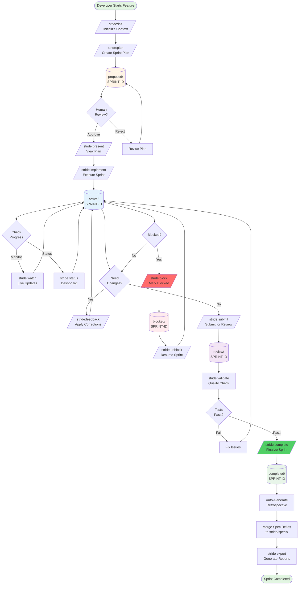
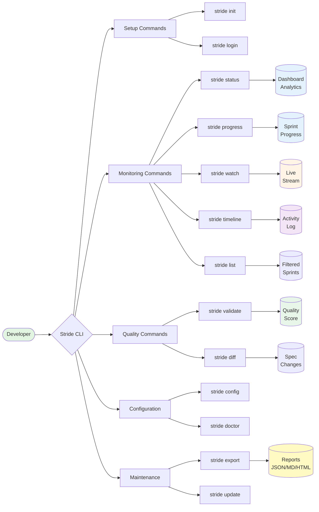
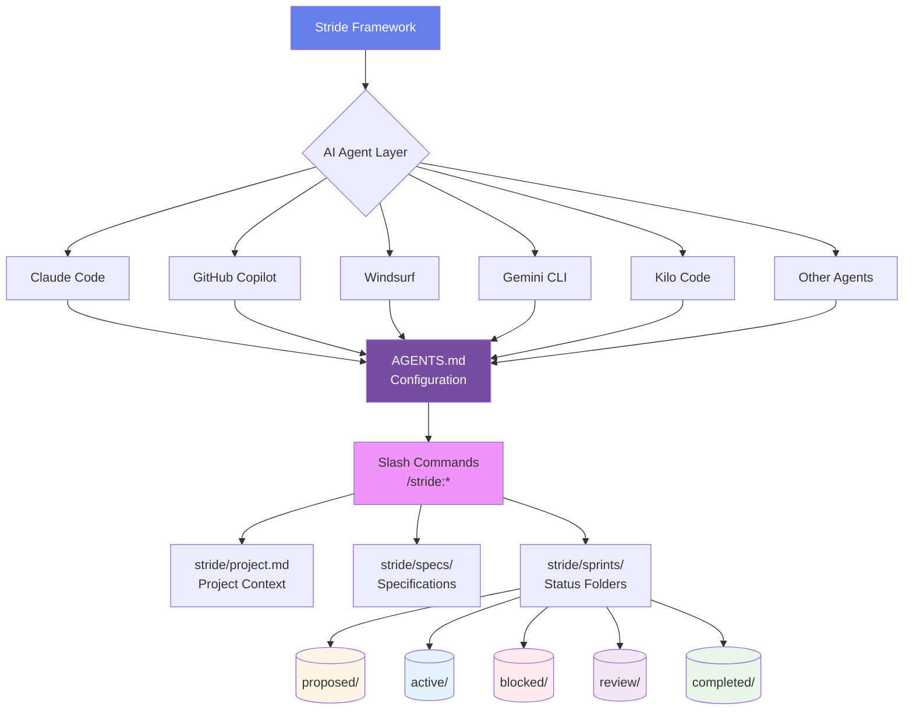

# **Stride**

> **Sprint-Powered, Spec-Driven Development for AI Agents**

---

**Stride** is the **sprint-powered, spec-driven development engine** that turns AI agents into reliable product teams—delivering features, not just code.

We combine **OpenSpec’s clarity**, **SpecKit’s rigor**, and **agile velocity** into a unified workflow that works for:
- Solo indie hackers shipping MVPs
- Small teams iterating on greenfield apps
- Enterprises retrofitting legacy systems

**Mission:** Make AI-assisted development *predictable*, *auditable*, and *fast* without meetings, without drift, without rework.

---

## **2. Core Principles**

| Principle | Description |
|--------|-------------|
| **Spec-First, Sprint-Second** | Every change starts with a locked spec; every spec becomes a time-boxed sprint. |
| **Agent-Agnostic** | Works with any Coding Agents such as Claude Code, Github Copilot, Gemini CLI, Kilo Code. |
| **Human-in-the-Loop** | Feedback is a first-class command; AI learns, adapts, and improves. |
| **Lightweight by Default, Rigorous on Demand** | Lite mode for quick fixes; full validation for production. |
| **Living Artifacts** | Specs, plans, and code evolve together—never stale. |

---

## **3. Target Users**

| Persona | Pain Point | Stride Solution |
|-------|-----------|-----------------|
| **Indie Hacker** | "AI writes code, but I lose context in 3 chats." | `/stride:init` → sprint → ship in one flow |
| **Startup CTO** | "We use Cursor + Claude, but outputs don’t align." | `AGENTS.md` + `/stride:plan` → unified tasks |
| **Enterprise Dev Lead** | "Can’t trust AI in legacy repos." | `/stride:introspect` + validation pipelines |

---

## **4. Key Features**

### AI Agent Commands (In-Editor)

| Feature | Command | Description | Inspired By |
|-------|--------|-------------|-------------|
| **Project Initialization** | `/stride:init` | Initialize project context and introspect repository | Stride Original |
| **Sprint Planning** | `/stride:plan <feature>` | Creates sprint in `proposed/` with tasks, estimates, risks | Stride + SpecKit |
| **Plan Presentation** | `/stride:present <ID>` | Renders plan as Markdown + Mermaid diagrams | Stride |
| **Automated Implementation** | `/stride:implement <ID>` | Moves to `active/`, executes sprint, outputs notes | Stride + OpenSpec |
| **Real-Time Feedback** | `/stride:feedback <ID> "note"` | Agent corrects course, updates plan mid-sprint | Stride Original |
| **Sprint Blocking** | `/stride:block <ID> "reason"` | Moves to `blocked/` folder, tracks impediments | Agile Workflows |
| **Sprint Unblocking** | `/stride:unblock <ID>` | Returns sprint to `active/` folder | Agile Workflows |
| **Review Submission** | `/stride:submit <ID>` | Moves to `review/` for testing/approval | Agile Workflows |
| **Sprint Closure** | `/stride:complete <ID>` | Moves to `completed/`, merges specs, creates retrospective | OpenSpec + Stride |

### CLI Commands (Terminal)

| Feature | Command | Description | Inspired By |
|-------|--------|-------------|-------------|
| **Framework Setup** | `stride init` | Initialize Stride framework and configure AI agents | Stride Original |
| **User Authentication** | `stride login` | Authenticate for sprint authorship tracking | Team Workflows |
| **Status Dashboard** | `stride status` | Sprint distribution and team analytics | Agile Dashboards |
| **Progress Monitoring** | `stride progress <ID>` | Detailed sprint progress with task breakdown | Stride Original |
| **Live Monitoring** | `stride watch <ID>` | Real-time sprint implementation streaming | DevOps Workflows |
| **Sprint Timeline** | `stride timeline <ID>` | Complete activity history with timestamps | Audit Trails |
| **Sprint Listing** | `stride list` | List/filter sprints by status, user, or date | Project Management |
| **Sprint Details** | `stride show <ID>` | Display complete sprint information | Stride Original |
| **Spec Comparison** | `stride diff <ID>` | Show specification changes made in sprint | Git Workflows |
| **Quality Validation** | `stride validate <ID>` | Validate sprint structure and code quality | CI/CD Pipelines |
| **Configuration** | `stride config` | Manage AI agents and project settings | Stride Original |
| **Health Check** | `stride doctor` | Validate installation and project health | Package Managers |
| **Data Export** | `stride export` | Export sprint data for reporting/integration | Enterprise Tools |
| **Updates** | `stride update` | Update Stride framework to latest version | Package Managers |

---

## **5. Advanced Features**

| Feature | Description | Priority |
|-------|-------------|----------|
| **Lite Mode** | `/stride:lite "Add dark mode"` → plan + implement in <200 lines | High |
| **User Authentication** | `stride login` → track authorship and team activity | High |
| **Live Monitoring** | `stride watch <ID>` → real-time sprint progress streaming | High |
| **Status Dashboard** | `stride status` → team analytics and sprint distribution | High |
| **Validation Pipelines** | `stride validate` → auto-run tests, lint, semantic checks | High |
| **Sprint Timeline** | `stride timeline <ID>` → complete activity history | High |
| **Introspection Engine** | AI scans legacy code → generates migration sprints | High |
| **Auto-Retrospectives** | AI generates retrospectives on `/stride:complete` | Medium |
| **Blocker Analytics** | Track time in `blocked/`, common impediments via `stride status` | Medium |
| **Export & Reporting** | `stride export` → Markdown/HTML/JSON reports for stakeholders | Medium |
| **Health Monitoring** | `stride doctor` → validate installation and project health | Medium |
| **Provenance Scores** | 0–100 badge: "Spec Alignment: 94%" | Low |

---

## **6. Technical Architecture**

```
┌─────────────────────┐
│   Agent Interface   │
│  (Claude Code,      |
│   Gemini CLI, Github|
|       Copilot       │
└───────┬─────────────┘
        │ /stride:*
        │
        │
        ▼
┌─────────────────────┐
│   LLM Backends      │
│  (Claude, Gemini,   │
│   Grok, Local, etc.)│
└───────┬─────────────┘
        │
        ▼
┌─────────────────────┐
│ Status-Based Folders│
│  • proposed/        │
│  • active/          │
│  • blocked/         │
│  • review/          │
│  • completed/       │
└─────────────────────┘
```

- **State**: Status-based folder structure (git-tracked)
- **Specs**: Markdown + YAML frontmatter in `stride/specs/`
- **Sprints**: Organized by lifecycle state in `stride/sprints/`
- **Metadata**: Frontmatter tracks dates, status, completion
- **Extensible**: Plugins via `stride.config.js`

### Sprint Workflow Diagram



### CLI Monitoring Flow



### Multi-Agent Integration



---

## **7. File Structure (Status-Driven)**

```bash
my-project/
├── stride/
│   ├── project.md                   # Project context, conventions, tech stack
│   ├── AGENTS.md                    # Multi-tool config (Claude, Cursor, etc.)
│   │
│   ├── specs/                       # Living specifications (current state)
│   │   ├── auth/
│   │   │   └── spec.md
│   │   ├── payments/
│   │   │   └── spec.md
│   │   └── ...
│   │
│   ├── sprints/
│   │   ├── proposed/                # Pending review/approval
│   │   │   └── SPRINT-7K9P/
│   │   │       ├── proposal.md
│   │   │       └── plan.md
│   │   │
│   │   ├── active/                  # Currently being worked on
│   │   │   └── SPRINT-5A2B/
│   │   │       ├── proposal.md
│   │   │       ├── plan.md
│   │   │       ├── design.md
│   │   │       ├── implementation.md
│   │   │       ├── feedback.log
│   │   │       └── specs/           # Spec deltas
│   │   │           └── auth/
│   │   │               └── spec.md
│   │   │
│   │   ├── blocked/                 # Waiting on dependencies/decisions
│   │   │   └── SPRINT-3X8Y/
│   │   │
│   │   ├── review/                  # Implementation done, pending verification
│   │   │   └── SPRINT-2M4N/
│   │   │
│   │   └── completed/               # Shipped and merged
│   │       └── SPRINT-6C4D/
│   │           ├── proposal.md
│   │           ├── plan.md
│   │           ├── implementation.md
│   │           ├── retrospective.md  # What went well/poorly
│   │           └── specs/
│   │
│   │
│   └── introspection/               # Legacy code analysis
│       ├── scan-results.json
│       └── migration-candidates.md 
```

### Sprint Lifecycle States

| Status | Description | Typical Duration | Commands |
|--------|-------------|------------------|----------|
| **proposed/** | Sprint planned but not started | Hours to days | `/stride:plan` → creates here |
| **active/** | Currently being implemented | 1-2 weeks | `/stride:implement` → moves here |
| **blocked/** | Paused due to dependencies/blockers | Variable | `/stride:block <ID> "reason"` |
| **review/** | Code done, awaiting testing/approval | 1-3 days | `/stride:submit <ID>` |
| **completed/** | Shipped to production | Permanent | `/stride:complete <ID>` |

### Key Benefits

- **Visual Status Tracking**: Folders immediately show sprint health
- **No Manual Archiving**: Sprints stay in `completed/` with metadata
- **Blocker Visibility**: `blocked/` folder makes impediments explicit
- **Review Stage**: Separates "code done" from "shipped"
- **Retrospectives**: Captures lessons learned in `completed/` sprints

---

## **8. Command Interface**

Stride provides two interfaces for sprint management:

### **AI Agent Commands** (In-Editor)
Slash commands used within AI agents (Claude Code, GitHub Copilot, Windsurf, etc.):

| Command | Description |
|---------|-------------|
| `/stride:init` | Initialize project context in AI agent |
| `/stride:plan <feature>` | Generate sprint plan (creates in `proposed/`) |
| `/stride:present <ID>` | Show plan with Mermaid diagrams |
| `/stride:implement <ID>` | Execute sprint implementation (moves to `active/`) |
| `/stride:feedback <ID> "note"` | Apply feedback to active sprint |
| `/stride:block <ID> "reason"` | Mark sprint as blocked |
| `/stride:unblock <ID>` | Resume blocked sprint |
| `/stride:submit <ID>` | Submit for review (moves to `review/`) |
| `/stride:complete <ID>` | Finalize and merge sprint (moves to `completed/`) |

### **CLI Commands** (Terminal)
System-level management, monitoring, and configuration:

#### Setup Commands

**`stride init`** - Initialize Stride framework in project
```bash
stride init
```
- Creates `stride/` folder structure
- Generates `AGENTS.md` with workflow instructions
- Prompts for AI agent selection (Claude Code, Copilot, Windsurf, etc.)
- Generates agent-specific configs

**`stride login`** - Authenticate user for tracking
```bash
stride login
```
- Enables sprint authorship tracking
- Associates user with project sprints
- Stores credentials in `~/.stride/config`

**`stride logout`** - Log out current user
```bash
stride logout
```

#### Monitoring Commands

**`stride status`** - Sprint distribution dashboard
```bash
stride status
stride status --user dev@example.com
stride status --detailed
```
Shows sprint counts across all status folders with team activity.

**`stride progress <ID>`** - Detailed progress for specific sprint
```bash
stride progress SPRINT-7K9P
```
Displays task completion, time estimates, and feedback history.

**`stride watch <ID>`** - Live monitoring of sprint implementation
```bash
stride watch SPRINT-7K9P --follow
```
Streams real-time updates as sprint progresses.

**`stride timeline <ID>`** - Sprint history and activity log
```bash
stride timeline SPRINT-7K9P
```
Shows chronological events (created, moved, feedback, completed).

**`stride list`** - List sprints with filtering
```bash
stride list
stride list --status active
stride list --user dev@example.com
stride list --format json
```
Filter by status, user, or export as JSON.

**`stride show <ID>`** - Display complete sprint details
```bash
stride show SPRINT-7K9P
```
Shows proposal, plan, implementation notes, and feedback log.

**`stride diff <ID>`** - Show spec deltas in sprint
```bash
stride diff SPRINT-7K9P
```
Displays changes to specs made during sprint.

#### Quality Commands

**`stride validate <ID>`** - Validate sprint structure
```bash
stride validate SPRINT-7K9P
stride validate SPRINT-7K9P --strict
```
Checks template compliance, metadata, and optional code quality (linting, tests, coverage).

#### Configuration Commands

**`stride config`** - Manage Stride configuration
```bash
stride config              # Interactive menu
stride config agents       # Add/remove AI agents
stride config show         # Display current config
stride config set <key> <value>
```
Manage AI agents, user settings, project settings, and validation rules.

#### Maintenance Commands

**`stride doctor`** - Validate installation and project health
```bash
stride doctor
stride doctor --fix
```
Checks Stride installation, project structure, configuration, and sprint health.

**`stride export`** - Export sprint data
```bash
stride export
stride export --format markdown
stride export --sprints completed
stride export --user dev@example.com
```
Generate reports (JSON, Markdown, HTML) for stakeholders or integration with project management tools.

**`stride update`** - Update Stride framework
```bash
stride update
stride update --check
```
Updates to latest version and regenerates configs.

---

## **9. Sample Workflow**

### **Initial Setup (CLI)**
```bash
# 1. Initialize Stride framework
stride init
> Select AI agents: [x] Claude Code [x] GitHub Copilot
✓ Created stride/ directory structure
✓ Configured agents

# 2. Authenticate for tracking
stride login
> Email: dev@example.com
✓ Authenticated as dev@example.com
```

### **Sprint Execution (AI Agent)**
```bash
# 3. Start a new feature (in AI agent)
/stride:init
> "Build a meme generator CLI with image overlays"

# 4. Generate sprint (creates in proposed/)
/stride:plan "Add text overlay with font support"
→ Created: sprints/proposed/SPRINT-7K9P/

# 5. Review plan
/stride:present SPRINT-7K9P
→ Mermaid task graph + risk flags

# 6. Implement (moves to active/)
/stride:implement SPRINT-7K9P
→ Moved to: sprints/active/SPRINT-7K9P/
→ Writes code, adds tests, outputs notes

# 7. Feedback (while active)
/stride:feedback SPRINT-7K9P "Use Pillow instead of Canvas"
→ Agent updates plan, re-implements
```

### **Monitoring Progress (CLI)**
```bash
# 8. Check overall status
stride status
→ Active: 2 sprints | Blocked: 1 sprint | Review: 3 sprints

# 9. Monitor specific sprint
stride progress SPRINT-7K9P
→ 67% complete | 2h remaining | Task 3 in progress

# 10. Watch live updates
stride watch SPRINT-7K9P
→ [15:20] Started Task 3: Token validation middleware
→ [15:25] Progress: 78% complete
```

### **Sprint Lifecycle (AI Agent)**
```bash
# 11. Block if needed
/stride:block SPRINT-7K9P "Waiting on font licensing approval"
→ Moved to: sprints/blocked/SPRINT-7K9P/

# 12. Unblock and continue
/stride:unblock SPRINT-7K9P
→ Moved to: sprints/active/SPRINT-7K9P/

# 13. Submit for review
/stride:submit SPRINT-7K9P
→ Moved to: sprints/review/SPRINT-7K9P/

# 14. Complete and ship
/stride:complete SPRINT-7K9P
→ Moved to: sprints/completed/SPRINT-7K9P/
→ Merged spec deltas to stride/specs/
→ Created retrospective.md
```

### **Quality & Reporting (CLI)**
```bash
# 15. Validate sprint quality
stride validate SPRINT-7K9P
→ Overall Score: 94/100 (Excellent)

# 16. View sprint history
stride timeline SPRINT-7K9P
→ Shows all events: created, moved, feedback, completed

# 17. Export for stakeholders
stride export --format markdown --sprints completed
→ Exported to reports/sprints-2025-11.md

# 18. Team analytics
stride status --team
→ Shows team activity, completed sprints, average duration
```

---

## **10. Competitive Differentiation**

| | **OpenSpec** | **SpecKit** | **Stride** |
|---|--------------|-------------|-----------|
| **Greenfield** | Good | Weak | Excellent |
| **Brownfield** | Excellent | Weak | Excellent (with Introspection) |
| **Speed** | Medium | Slow | Fast (Lite Mode) |
| **Rigor** | Medium | High | High (Validation) |
| **Feedback Loop** | Weak | Weak | Excellent (Real-time) |
| **Multi-Tool** | Excellent | Medium | Excellent (AGENTS.md) |
| **Status Tracking** | Weak | Weak | Excellent (Folder-Based + CLI) |
| **Live Monitoring** | None | None | Excellent (`stride watch`) |
| **Team Collaboration** | Weak | Medium | Excellent (User tracking) |
| **Blocker Management** | None | Weak | Explicit (blocked/ folder) |
| **Reporting** | Weak | Medium | Excellent (Export + Analytics) |
| **Audit Trail** | Excellent | High | Excellent + Timeline + Retrospectives |

**Stride = OpenSpec's portability + SpecKit's validation + Agile velocity + DevOps monitoring + Team collaboration**

### Key Differentiators

1. **Dual Interface**: AI agent commands (in-editor) + CLI commands (terminal) for complete workflow coverage
2. **Real-Time Monitoring**: `stride watch` provides live sprint progress streaming
3. **Team Analytics**: User authentication enables authorship tracking and team collaboration
4. **Visual Status Management**: Folder-based status + CLI dashboard for instant sprint health visibility
5. **Comprehensive Reporting**: Export to Markdown/HTML/JSON for stakeholder communication
6. **Health Monitoring**: `stride doctor` validates entire project setup and sprint consistency

---

## **11. MVP Success Metrics (Q1 2026)**

| Metric | Target | Measurement |
|-------|--------|-------------|
| **GitHub Stars** | 2,000+ | Community adoption |
| **Active Users** | 500+ | Weekly active CLI usage |
| **Sprint Completion Rate** | >85% | Sprints reaching `completed/` folder |
| **Feedback Loop Usage** | >60% | Sprints using `/stride:feedback` |
| **Tool Integrations** | 5+ agents | Claude Code, Copilot, Windsurf, Gemini CLI, Kilo Code |
| **Average Sprint Duration** | <5 days | Time from `proposed/` to `completed/` |
| **User Retention** | >70% | Users active after 30 days |
| **Export Usage** | >40% | Projects using `stride export` |
| **Validation Adoption** | >50% | Projects using `stride validate` |

---

## **12. Roadmap**

### **Q4 2025 - Foundation**
- ✅ Core framework design
- ✅ Status-driven folder structure
- 🔨 MVP CLI implementation (`init`, `status`, `list`, `show`)
- 🔨 AI agent command specification (`/stride:plan`, `/stride:implement`)
- 🔨 Basic validation and health checks

### **Q1 2026 - Launch**
- 🎯 Complete CLI suite (all 15 commands)
- 🎯 User authentication (`stride login`)
- 🎯 Live monitoring (`stride watch`)
- 🎯 Multi-agent support (Claude Code, Copilot, Windsurf, Gemini CLI, Kilo Code)
- 🎯 Export capabilities (Markdown, HTML, JSON)
- 🎯 VS Code extension (optional)
- 🎯 Documentation and tutorials
- 🎯 Community launch

### **Q2 2026 - Enhancement**
- 🔮 Validation pipelines (auto-lint, type-check, test coverage)
- 🔮 Introspection engine (legacy code analysis)
- 🔮 Auto-retrospectives on sprint completion
- 🔮 Blocker analytics dashboard
- 🔮 Integration APIs (Jira, Linear, GitHub Issues)
- 🔮 Stride Hub (Community sprints)
- 🔮 Team collaboration features

### **Q3 2026 - Enterprise**
- 🔮 Advanced provenance scores (spec alignment metrics)
- 🔮 Enterprise SSO and permissions
- 🔮 Custom validation rules and hooks
- 🔮 CI/CD pipeline integrations
- 🔮 Multi-project management
- 🔮 Audit and compliance features
- 🔮 Private Stride Hub for enterprises

**Legend:** ✅ Complete | 🔨 In Progress | 🎯 Next Quarter | 🔮 Future

---

## **13. Risks & Mitigations**

| Risk | Impact | Mitigation Strategy |
|------|--------|---------------------|
| **AI Hallucination** | Sprint implementation produces incorrect code | Validation pipelines + human review gates + `stride validate` |
| **Sprint Creep** | Sprints grow beyond scope | Lite Mode + auto-task caps + feedback enforcement |
| **Tool Lock-in** | Users dependent on specific AI agent | `AGENTS.md` + fallback stubs + agent-agnostic design |
| **Adoption Lag** | Slow community uptake | Co-market with Cursor, Claude, Windsurf + seed Stride Hub |
| **Complexity Overload** | Users overwhelmed by commands | Progressive disclosure +  `stride doctor` guidance |
| **Team Conflicts** | Multiple users editing same sprint | File-based locking + clear sprint ownership + conflict detection |
| **Data Loss** | Sprint data corruption | Git-tracked folders + backup recommendations + `stride doctor` checks |

---

## **14. Call to Action**

**Stride is open for contribution.**  
Let's build the future of AI-native development—**spec-driven, sprint-powered, human-aligned.**

---

## **Quick Reference**

### AI Agent Commands (In-Editor)
```bash
/stride:init                       # Initialize project context
/stride:plan "feature"             # Create sprint plan
/stride:present SPRINT-ID          # Show plan with diagrams
/stride:implement SPRINT-ID        # Execute sprint
/stride:feedback SPRINT-ID "note"  # Apply feedback
/stride:block SPRINT-ID "reason"   # Mark as blocked
/stride:unblock SPRINT-ID          # Resume sprint
/stride:submit SPRINT-ID           # Submit for review
/stride:complete SPRINT-ID         # Finalize sprint
```

### CLI Commands (Terminal)
```bash
# Setup
stride init                        # Initialize framework
stride login                       # Authenticate user
stride logout                      # Log out

# Monitoring
stride status                      # Dashboard overview
stride progress SPRINT-ID          # Sprint progress
stride watch SPRINT-ID             # Live monitoring
stride timeline SPRINT-ID          # Activity history
stride list                        # List sprints
stride show SPRINT-ID              # Sprint details
stride diff SPRINT-ID              # Spec changes

# Quality & Config
stride validate SPRINT-ID          # Validate sprint
stride config                      # Manage settings
stride doctor                      # Health check

# Maintenance
stride export                      # Export data
stride update                      # Update framework
```

### Common Workflows
```bash
# Quick start
stride init && stride login

# Monitor active sprints
stride status && stride list --status active

# Check specific sprint
stride progress SPRINT-7K9P && stride timeline SPRINT-7K9P

# Quality check before completion
stride validate SPRINT-7K9P && stride diff SPRINT-7K9P

# Generate report
stride export --format markdown --sprints completed
```

---

> **"Code is easy. Shipping is hard. Stride makes shipping inevitable."**  
> — *Stride Manifesto*
