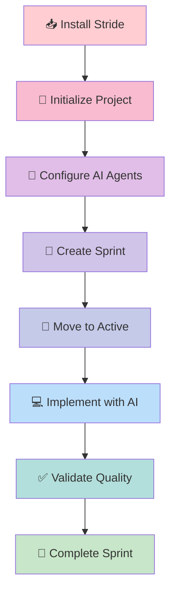

# Getting Started with Stride

Welcome! This guide will help you install Stride and create your first sprint in less than 10 minutes.

## What You'll Learn

By the end of this guide, you'll:

- ✅ Install Stride on your system
- ✅ Initialize Stride in a project
- ✅ Configure AI agent integrations
- ✅ Create and manage your first sprint
- ✅ Understand the core workflow

## Prerequisites

Before you begin, ensure you have:

- **Python 3.11+** installed
- **Git** for version control
- **Terminal/Command Line** access
- (Optional) An AI coding agent like Claude Code, Cursor, or Windsurf

## Next Steps

Choose your path:

-   :material-download: **Installation**

    ---

    Install Stride and set up your development environment.

    [:octicons-arrow-right-24: Install Now](installation.md)

-   :material-rocket-launch: **Quick Start**

    ---

    Jump straight into creating your first sprint.

    [:octicons-arrow-right-24: Quick Start](quickstart.md)

-   :material-book-open-variant: **Core Concepts**

    ---

    Understand the principles behind Stride.

    [:octicons-arrow-right-24: Learn Concepts](concepts.md)

## Typical Workflow

Here's what a typical Stride workflow looks like:

## Common Use Cases

### Solo Developer
You're building a side project with AI assistance and want to track what gets implemented.

**Stride helps you:**
- Track implementation history
- Validate code quality
- Export progress reports
- Switch between AI tools seamlessly

### Team Development
Your team uses various AI agents and needs coordination.

**Stride helps you:**
- Standardize workflows across agents
- Track who implemented what
- Generate team analytics
- Maintain audit trails

### AI-First Workflow
You primarily code with AI assistants and need structure.

**Stride helps you:**
- Organize AI conversations into sprints
- Prevent context loss
- Apply quality gates
- Build reliable artifacts

## Time Investment

- **Installation**: 5 minutes
- **First Sprint**: 10 minutes
- **Learning Curves**: 30 minutes
- **Proficiency**: 2-3 sprints

## Support

Need help? Check out:

- 📖 [User Guide](../user-guide/index.md) - Complete reference
- 🎓 [Tutorials](../tutorials/index.md) - Step-by-step guides
- 💬 [GitHub Discussions](https://github.com/saranmahadev/Stride/discussions) - Ask questions
- 🐛 [Report Issues](https://github.com/saranmahadev/Stride/issues) - Found a bug?

---

Ready to get started? Head to [Installation](installation.md) →
