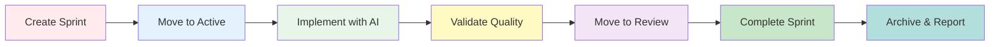

# Welcome to Stride

> **Sprint-Powered, Spec-Driven Development for AI Agents**

---

{ width="200" }

**Stride** is a powerful sprint management framework designed for developers working with AI coding agents. It brings structure, visibility, and control to AI-assisted development through a status-driven workflow.

## What is Stride?

Stride transforms chaotic AI-assisted coding into organized, trackable sprints. Instead of losing context across multiple AI conversations, you maintain a clear history of what was built, why, and how.

### Key Benefits

- 🎯 **Organized Development** - Status-based folder system (proposed → active → blocked → review → completed)
- 🤖 **Multi-Agent Support** - Works with 20+ AI coding tools (Claude, Cursor, Windsurf, etc.)
- 📊 **Complete Visibility** - Track every change, monitor progress in real-time
- ✅ **Quality Control** - Built-in validation and health checks
- 📈 **Rich Reporting** - Export to JSON, Markdown, CSV, or HTML

## Quick Example

```bash
# Initialize Stride
stride init
stride agent init

# Create a sprint
stride create --title "Add user authentication"
# → SPRINT-7K9P created

# Work on it
stride move SPRINT-7K9P active
stride watch SPRINT-7K9P  # Monitor in real-time

# Complete it
stride validate SPRINT-7K9P
stride move SPRINT-7K9P completed
```

## Why Stride?

### The Problem

When using AI coding agents like Claude Code or Cursor, developers face:

- Lost context across multiple AI conversations
- No clear history of what was implemented
- Difficulty tracking changes and decisions
- Lack of quality validation
- No coordination between different AI tools

### The Solution

Stride provides:

- **Sprint-Based Workflow** - Every feature becomes a trackable sprint
- **Status Management** - Visual folder-based lifecycle
- **AI Agent Integration** - Unified commands across 20+ tools
- **Quality Gates** - Validation before completion
- **Comprehensive Reporting** - Export and share progress

## Core Workflow



## What's Next?

<div class="grid cards" markdown>

-   :material-rocket-launch: **Getting Started**

    ---

    Install Stride and create your first sprint in 5 minutes.

    [:octicons-arrow-right-24: Quick Start](getting-started/quickstart.md)

-   :material-brain: **AI Agents**

    ---

    Integrate with Claude, Cursor, Windsurf, and 17 more AI tools.

    [:octicons-arrow-right-24: AI Integration](ai-agents/overview.md)

-   :material-book-open: **User Guide**

    ---

    Complete reference for all CLI commands and features.

    [:octicons-arrow-right-24: User Guide](user-guide/index.md)

-   :material-school: **Tutorials**

    ---

    Step-by-step tutorials for common workflows.

    [:octicons-arrow-right-24: Tutorials](tutorials/index.md)

</div>

## Features at a Glance

### Sprint Management
- Create, list, move, archive sprints
- Status-based folder organization
- Sprint templates with metadata
- Timeline and history tracking

### Monitoring & Validation
- Real-time sprint watching
- Progress tracking with task completion
- Health checks and validation
- Quality scoring

### AI Agent Integration
- 20+ supported AI tools
- Slash command workflows
- Managed configuration blocks
- Universal fallback support

### Reporting & Export
- Multiple formats (JSON, Markdown, CSV, HTML)
- Advanced filtering (status, date, user, priority)
- Team analytics and dashboards
- Customizable templates

## Community & Support

- **GitHub**: [github.com/saranmahadev/Stride](https://github.com/saranmahadev/Stride)
- **Documentation**: You're reading it! 📖
- **Issues**: Report bugs or request features
- **Discussions**: Ask questions and share ideas

## Version

Current version: **v1.0.0** (November 2025)

- ✅ 454 tests passing
- ✅ 73% code coverage
- ✅ 18 CLI commands
- ✅ 20 AI agent integrations

---

<p align="center">
  <strong>"Code is easy. Shipping is hard. Stride makes shipping inevitable."</strong>
</p>
