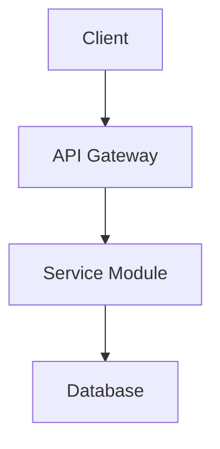

# Design

## Architecture
[Describe the high-level architecture relevant to this sprint.  
Use structured text or Mermaid diagrams to represent modules, components,  
services, layers, and boundaries affected by this sprint.]

Example areas to cover:
- New modules introduced  
- Existing modules modified  
- Component-to-component interactions  
- Backend/frontend boundary changes  
- Server-side logic flow  
- Microservices or service boundaries  
- Dependency inversion or abstraction layers  

If using Mermaid:


## Data Flow

[Explain how data enters, transforms, moves, and exits the system as part of this sprint.
Describe request/response flow, internal pipelines, state transitions, or event propagation.]

Include:

* Input sources
* Processing steps
* Validation logic
* Output destinations
* Persistent storage interactions
* Error flows and fallback paths

Note: Keep it architectural. Do *not* describe actual code implementations.

---

## APIs / Interfaces

[List the APIs, interfaces, contracts, or function signatures this sprint depends on or modifies.]

For each API or interface, specify:

### [API / Interface Name]

**Purpose:**
[What this interface is responsible for]

**Endpoint / Signature:**

```
[GET|POST|PUT|DELETE] /path  
function example(param: Type): ReturnType
```

**Request Model:**

* [Field name]: [Type] — [Description]
* [Field name]: [Type] — [Description]

**Response Model:**

* [Field name]: [Type] — [Description]

**Error Model:**

* [Error Type]: [Status Code] — [Condition]

**Notes:**

* Compatibility rules
* Input/output constraints
* Versioning considerations
* Mapping to acceptance criteria

---

## Data Models

[Describe new or modified data models, schemas, DTOs, or domain objects.]

For each model:

### [Model Name]

**Fields:**

* [field]: [type] — [description]
* [field]: [type] — [description]

**Constraints:**

* Validation rules
* Referential integrity
* Indexing or optimization considerations

**Notes:**

* Migration steps (if applicable)
* Backward compatibility rules

---

## Decisions & Trade-offs

[Record critical decisions made during design.
Justify why the chosen path is preferred over alternatives.]

For each decision:

### Decision: [Short Name]

**Context:**
[Problem or need]

**Chosen Approach:**
[Describe the accepted solution]

**Alternatives Considered:**

* Option A — [Why not chosen]
* Option B — [Why not chosen]

**Rationale:**
[Reasons tied to performance, complexity, security, risk, etc.]

**Impact:**

* Affects modules: [list]
* Potential regressions: [list]
* Long-term implications: [list]

---

## Security & Compliance Considerations

[List all security and compliance factors relevant to this sprint.]

Include:

### Authentication & Authorization

* [Describe required permission checks]
* [Sensitive flows that must be protected]

### Data Protection

* [Fields requiring encryption]
* [Secrets or credentials handling]

### Compliance Rules

* GDPR / HIPAA / PCI implications
* Logging and observability restrictions

### Threat Model Notes

* Possible attack vectors
* Mitigation strategies
* Hardening requirements

---

## Limitations & Open Questions

[List limitations that impact the design and questions that must be resolved.]

### Limitations

* [Technical constraints]
* [Missing future context]
* [Performance ceilings]

### Open Questions

* [Question 1 requiring user clarification]
* [Question 2 requiring decision from architecture]
* [Question 3 requiring product confirmation]

All open questions MUST be resolved before implementation begins or during `/stride-feedback`.

---